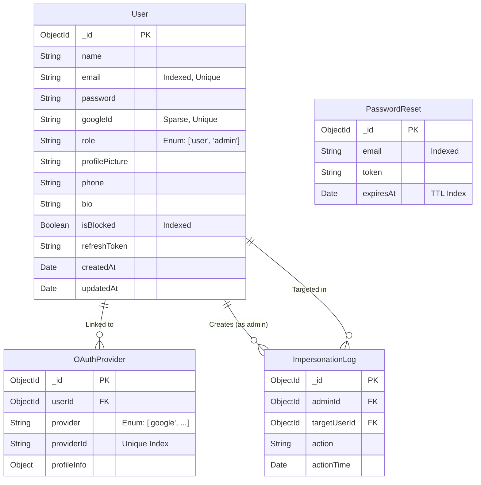

# Fovty Solutions - User Management System

A robust, full-stack User Management System built with the MERN stack (MongoDB, Express, React, Node.js), featuring a beautiful, dynamic, and responsive Vanilla CSS design system.

## Features

**User Panel**
- Secure Authentication (JWT, bcrypt, HTTP-Only Cookies)
- Login / Registration with server-side validation
- Profile Management (Update name, bio, phone, picture, change password)
- Google OAuth (Placeholder structure ready)

**Admin Panel**
- Role-Based Access Control (Admin only)
- User dashboard with pagination, search, and filtering
- Full CRUD operations on users
- Block/Unblock users
- **Impersonation System**: Admins can impersonate users, log their actions, and seamlessly switch back to the admin interface.

## Scalable MongoDB Architecture

- Indexes on `email`, `role`, and `isBlocked` for fast queries.
- Pagination implemented natively using `.skip()` and `.limit()`.
- Separate collection for `ImpersonationLog` to track admin actions efficiently.

### ER Diagram (Mermaid)

### Google OAuth Setup
To enable Google Login, you must update the `GOOGLE_CLIENT_ID` in `frontend/src/main.jsx`.
1. Create a project in [Google Cloud Console](https://console.cloud.google.com/).
2. Create OAuth 2.0 Client ID.
3. Add `http://localhost:5173` to Authorized JavaScript origins.
4. Copy the Client ID into `main.jsx`.

## Setup Instructions

### 1. Prerequisites
- Node.js (v18+)
- MongoDB (Atlas or Local)

### 2. Backend Setup
1. `cd backend && npm install`
2. Create `.env` with `MONGO_URI`, `ACCESS_TOKEN_SECRET`, `REFRESH_TOKEN_SECRET`.
3. `npm run dev`

### 3. Frontend Setup
1. `cd frontend && npm install`
2. `npm run dev`

## API Documentation

### Authentication (`/api/auth`)
- `POST /register`: Register user
- `POST /login`: Login user
- `POST /logout`: Logout
- `POST /google`: Google OAuth
- `POST /forgot-password`: Request reset token
- `POST /reset-password`: Reset password with token

### User Profile (`/api/users`) - *Protected*
- `GET /profile`: Get profile
- `PUT /profile`: Update profile (supports `multipart/form-data` for picture)
- `PUT /change-password`: Change password

### Admin (`/api/admin`) - *Protected (Admin only)*
- `GET /users`: Paginated user list with search
- `POST /users/:id/impersonate`: Start impersonation

### User Profile (`/api/users`) - *Protected*
- `GET /profile`: Get current user profile
- `PUT /profile`: Update profile info
- `PUT /change-password`: Update password

### Admin (`/api/admin`) - *Protected (Admin only)*
- `GET /users`: Get paginated users (`?page=1&limit=10&search=xyz`)
- `POST /users`: Create a user
- `GET /users/:id`: Get specific user
- `PUT /users/:id`: Update user (role, block status, etc.)
- `DELETE /users/:id`: Delete user
- `POST /users/:id/impersonate`: Start impersonating user

## Security Implementation
- `bcrypt`: Password Hashing
- `helmet`: Secure HTTP headers
- `express-rate-limit`: Prevent brute-force & DDoS
- `express-validator`: Server-side input validation
- **HTTP-Only Cookies**: Prevents XSS attacks on JWT tokens
- **CORS Configured**: Mitigates CSRF effectively by restricting origins.
